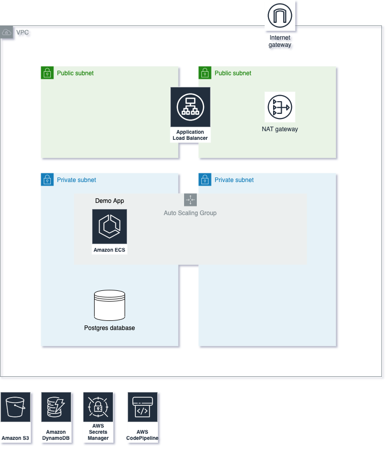
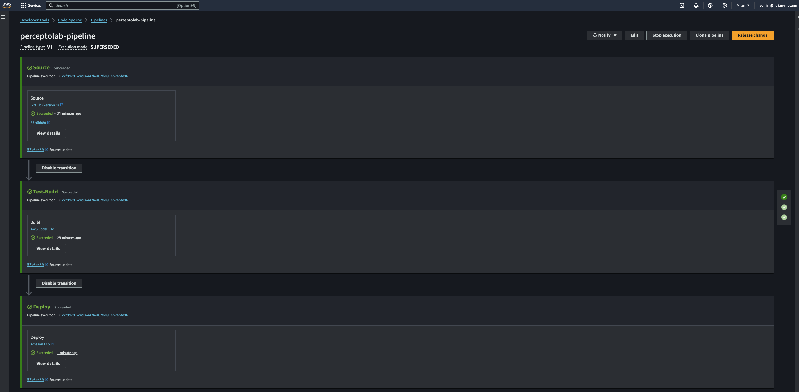
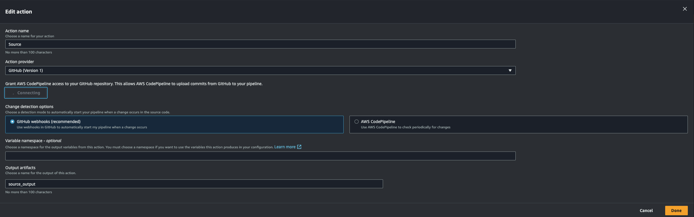
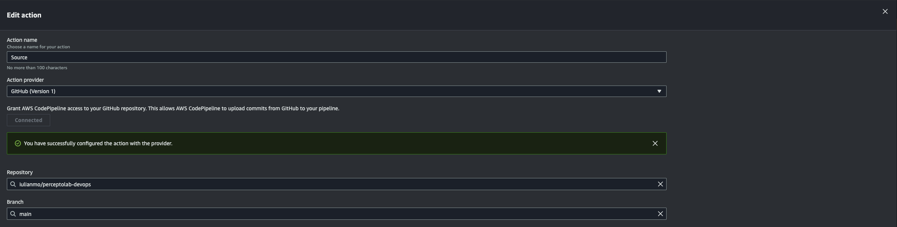

# AWS DevOps: Infrastructure as Code with Terraform
This project deploys a Docker application on AWS, utilizing services such as VPC, EC2, ECS, Secrets Manager, and CloudWatch. Infrastructure is managed with Terraform (version 1.7.1), while CI/CD is implemented using CodeBuild and CodePipeline, focusing on security and scalability. The OCI image repository is Docker Hub, and I aimed to implement most of the AWS best practices.

## Architecture



### CI/CD



## Description

- **Create a Continuous Delivery pipeline:** 
    - I used CodeBuild for the test and build actions, and CodePipeline for the workflow management and deployment. I also set up an automatic trigger from this GitHub repository to execute the pipeline whenever a new commit is pushed.
    - I wrote the buildspec file (*terraform/main/pipeline/buildspec.yml*).

- **Unit Test:**
    - CodeBuild executes the tests, and if there is any failure, the pipeline aborts. I also implemented CloudWatch logs for observability.

- **Build the OCI image and push it to a public registry:**
    - CodeBuild also builds the OCI image, tags it, and pushes it to my [Docker Hub repository](https://hub.docker.com/repository/docker/iulianmo/devopsdemo/general).

- **Create Cloud Infrastructure using IaaC:**
    - I followed best practices to create the infrastructure (see the diagram above).
    - I added security and network isolation using an Application Load Balancer that forwards traffic to the ECS service.

- **Manually deploy the app in the server using Docker:**
    - PostgreSQL is running on the ECS instances (I did not implement RDS for cost reasons), and it is set up automatically with the User Data script (*terraform/main/ecs/user-data.tpl*).
    - I used ECS on an EC2 AutoScaling Group for orchestration. I ran the container directly on the VM only for the first test.

- **The app must be reachable via the server Public IP on HTTP Plain port:** 
    - For security best practices, the server is private. Only the Load Balancer is public on port 80.


### Advanced Tasks

1. **Create a Cron Job which pulls the latest app image:**
    - The Cron Job is automatically set up with the User Data script (*terraform/main/ecs/user-data.tpl*) and runs every hour to check for new versions available.

2. **Update the server deployment once a new image hash has been pulled:**
    -  If a new version is detected, it triggers the pipeline to update the server deployment.

3. **Improve the infrastructure security by defining new resources:**
    - Already done!

4. **The app must be reachable via the external Load Balancer DNS on HTTP:**
    - It's up & running! -> http://<ALB_DNS_NAME>/api/status


## Prerequisites

- terraform 1.7.1 or greater


## Steps to deploy the infrastracture on AWS using Terraform

1. `export AWS_PROFILE=<IAM_PROFILE_NAME>`

2. `aws s3api create-bucket --bucket devopsdemo-tf --region eu-south-1`

3. `aws dynamodb create-table --table-name devopsdemo-tf --attribute-definitions AttributeName=LockID,AttributeType=S --key-schema AttributeName=LockID,KeyType=HASH --region eu-south-1`

4. Create EC2 Key Pair from the AWS Console: **devopsdemo-ecs-instances**

5. `chmod +x deploy_all.sh`

6. `./deploy_all.sh`

7. Connect GitHub repository to CodePipeline:
    - Go to GitHub profile 
    - Settings > Developer Settings > Personal access tokens > Tokens (classic) > Generate new token (classic)
    - Select *repo*
    - Copy the token and past it in Secret "devopsdemo-github": 
        `{"oauthtoken":"<YOUR_TOKEN>"}`
 
    - Go to CodePipeline > Edit > Edit Stage "Source"
    - Click on "Connect to GitHub" > Confirm > select the repository name and the branch > Done > Save






8. Connect Docker Hub:
    - Go to Docker Hub profile
    - My Account > Security > New Access Token > Copy the username and the token, then paste it in Secret "devopsdemo-dockerhub":
        `{"docker_user":"<YOUR_USERNAME>","docker_password":"<YOUR_TOKEN>"}`

9. Finally, you can test the pipeline by clicking on "Release Change."


## Test Endpoints

You can test the application endpoints. The **/actuator/health** API is utilized by the ALB for health checking the application.

```
curl -X PUT http://<ALB_DNS_NAME>/api/counter
curl -X DELETE http://<ALB_DNS_NAME>/api/counter
curl http://<ALB_DNS_NAME>/api/status
curl http://<ALB_DNS_NAME>/api/ext/users
curl http://<ALB_DNS_NAME>/api/ext/posts
curl http://<ALB_DNS_NAME>/api/db/users
curl -X PUT -H "Content-Type: application/json" -d '{"name":"Iulian Mocanu","email":"iulian.mocanu@example.com","phone":"1234567890"}' http://<ALB_DNS_NAME>/api/db/users
curl http://<ALB_DNS_NAME>/api/db/users/1
curl http://<ALB_DNS_NAME>/actuator/health
curl http://<ALB_DNS_NAME>/actuator/prometheus
```


## Issue

Initially, I faced memory constraints while using the **t3.micro** instance type, but upgrading to the **t3.medium** instance type resolved the issue.

```
[root@ip-10-0-0-201 ~]# docker run -p 8080:8080 -e DB_PASS=XXXXX iulianmo/devopsdemo:latest
Setting Active Processor Count to 2
Calculating JVM memory based on 565168K available memory
For more information on this calculation, see https://paketo.io/docs/reference/java-reference/#memory-calculator
unable to calculate memory configuration
fixed memory regions require 636081K which is greater than 565168K available for allocation: -XX:MaxDirectMemorySize=10M, -XX:MaxMetaspaceSize=124081K, -XX:ReservedCodeCacheSize=240M, -Xss1M * 250 threads
ERROR: failed to launch: exec.d: failed to execute exec.d file at path '/layers/paketo-buildpacks_bellsoft-liberica/helper/exec.d/memory-calculator': exit status 1
```
